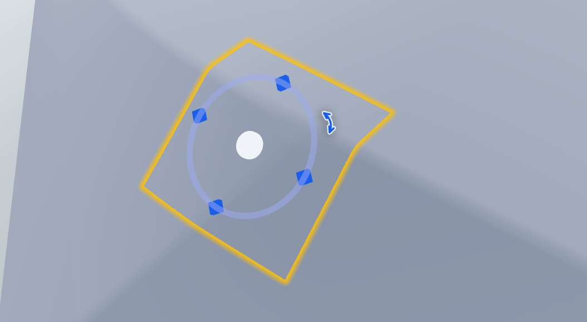

# three-surface-gizmo

A surface-aligned 3D transform gizmo for three.js. Unlike standard transform controls that move objects in free 3D space, this gizmo **sticks to surfaces** — perfect for decal placement, texture projection, and surface editing tools.

<p align="center">
  
</p>

**Move** — drag across the surface (raycasts against the model, re-projects onto faces)  
**Rotate** — spin around the surface normal with 90° snap  
**Scale** — radial scaling within configurable min/max bounds  

Supports both vanilla three.js and R3F (`@react-three/fiber`).

## Install

```bash
npm install three-surface-gizmo
# Or
pnpm add three-surface-gizmo
```

Optional peer dependencies (only needed if you use the R3F entry):

```bash
npm install @react-three/fiber react react-dom
```

## Usage

### Vanilla three.js

```ts
import { createGizmo } from "three-surface-gizmo";
import { Scene, PerspectiveCamera, WebGLRenderer } from "three";

const scene = new Scene();
const camera = new PerspectiveCamera(50, width / height, 0.1, 100);
const renderer = new WebGLRenderer({ canvas });

// When you have a model and a selected mesh:
const gizmo = createGizmo({
  scene,
  camera,
  renderer,
  object: modelRoot,          // The model root (raycast target for move mode)
  targetMesh: selectedMesh,   // Current binding mesh
  position: [0, 0, 0],        // Target mesh local space
  normal: [0, 1, 0],          // Target mesh local space
  rotation: 0,
  scale: 1,
  minScale: 0.05,
  maxScale: 0.6,
  onUpdate: (patch) => {
    // patch: { position?, normal?, rotation?, scale?, targetMesh? }
    // Update your data model here
  },
});

// Later:
gizmo.dispose();
```

### R3F (React Three Fiber)

```tsx
import { useState } from "react";
import { Canvas } from "@react-three/fiber";
import { Gizmo, GizmoCursorOverlay } from "three-surface-gizmo/r3f";
import { EMPTY_GIZMO_CURSOR } from "three-surface-gizmo";

function Scene() {
  const [cursor, setCursor] = useState(EMPTY_GIZMO_CURSOR);
  const [interacting, setInteracting] = useState(false);

  return (
    <div className="relative w-full h-full">
      <Canvas>
        <Gizmo
          position={[0, 0, 0]}
          normal={[0, 1, 0]}
          rotation={0}
          scale={1}
          object={modelObject}
          targetMesh={selectedMesh}
          minScale={0.05}
          maxScale={0.6}
          onUpdate={(patch) => { /* update decal data */ }}
          onInteractChange={setInteracting}
          onCursorChange={setCursor}
        />
      </Canvas>
      <GizmoCursorOverlay {...cursor} />
    </div>
  );
}
```

### Low-level APIs

The package exposes its building blocks for advanced use:

```ts
import { GizmoController } from "three-surface-gizmo";
import { orientToNormalQ, transportRotation } from "three-surface-gizmo";
import { computeGizmoCursorState } from "three-surface-gizmo";
```

## API

### createGizmo (native)

```ts
function createGizmo(options: NativeGizmoOptions): {
  controller: GizmoController;
  dispose(): void;
  update(): void;
}
```

### &lt;Gizmo&gt; (R3F)

```tsx
interface GizmoProps {
  position: [number, number, number];
  normal: [number, number, number];
  rotation: number;
  scale: number;
  object: Object3D;         // Model root (raycast target)
  targetMesh: Mesh;         // Current binding mesh
  minScale: number;
  maxScale: number;
  onUpdate: (patch: GizmoPatch) => void;
  onInteractChange?: (active: boolean) => void;
  onCursorChange?: (state: GizmoCursorState) => void;
}
```

### &lt;GizmoCursorOverlay&gt;

DOM overlay component that renders SVG cursor icons (rotate arc, move cross, scale arrows) following the mouse. Must be rendered outside the Canvas.

## Motivation

Three.js's built-in `TransformControls` and drei's `GizmoHelper` work in free 3D space. When building surface-editing tools (decals, stickers, texture projection), you need:

- Move constrained to the model surface
- Rotation around the surface normal
- Scale that stays on the surface plane
- Cross-mesh movement with parallel transport of rotation

This gizmo does all of the above with a single unified control.

## License

MIT